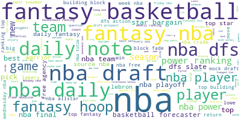

# Topic Modeling with NBA Headlines and Tweets
For reference the notebooks in this repo should be viewed in the following order:
1. webscraping_headlines.ipynb
2. scraping_tweets.ipynb
3. visualizing_clusters.ipynb
4. modeling_headlines.ipynb
5. modeling_tweets.ipynb

ESPN NBA headlines were webscraped from the ESPN NBA news archive webpage.
Tweets were collected using the Twint library from the following accounts: Yahoo Sports NBA, The Crossover, The Athletic, Slam Newswire, Basketballnews.com, SB Nation NBA, and HoopsHype. 

All headlines and tweets were collected between January 2016 through the end of February 2021.

# Introduction
Oftentimes, in basketball (and all sports in general), we usually look to numbers and statistics to understand what is going on and evaluate the game and its players. Many a fan will make the argument that "numbers never lie" in order to justify why they think a player or team is better and/or deserves certain accolades. However, there's far more to an NBA season than just the numbers.  There are a number of narratives that occur throughout any given season and the way we discuss those narratives will impact our perception of the game. Fortunately, we can use natural language processing to sift through large amounts of text data to try and understand what those narratives are and uncover the defining topics in basketball. 

## Business Understanding

### Why do we need topic modeling within the NBA discourse?
The NBA and its media partners have to market and sell the game of basketball to its fans. We can use the topic modeling to discover what the most common topics are in a set of text data. If an organization can understand what is most discussed, then they can leverage that information to better promote and curate content that aligns with popular interest. We also have the ability to evaluate sentiment of specific text and thereby understand general sentiment of a topic. If the sentiment were negative (e.g. repeated complaints about the dunk contest) then that would provide the impetus to try and come up with ways to improve a product so that it may become well recieved by the public.

The goal for this project to use different clustering methods to discover the common topics within NBA text data and build a model that could then classify a specific text as belonging to particular topic.  A model that can accomplish this task well could be used as part of a recommendation system in an app that provides different type of content to fans. It could also be used as part of archive or database where searching for a topic could bring up relevant headlines or tweets, similar to how NLP models are used in legal databases to search for similar court cases.

## Exploratory Data Analysis

Topics were identified for both headlines and tweets using kmeans clustering by calculating the Calinski-Harabasz score for different values of k and looking for the elbow in the resulting plot.  For headlines, I found that the clustering worked with best for a value of k=3. It was also possible to look for clusters within clusters as there was typically one major cluster that contained significantly more headlines. For tweets, values of k=4 and k=5 both produced well defined clusters. I used the labels generated by this clustering as the target values for modeling.

I also used Latent Dirichlet Allocation to look for underlying topics within the data. The `visualizing_clusters.ipynb` notebook includes interactive visuals that show the size, dispersity and common words for each cluster. For both headlines and tweets, the LDA algorithm 

Below are the most common words in ESPN NBA headlines when k=3 and wordclouds for each class:

The topics found within ESPN NBA Headlines were:
1. Mixed Bag with keywords focused on popular players and teams (this cluster contained two smaller clusters related to the Warriors and player contracts/signings)
2. Game scores/outcomes
3. NBA Draft and daily fantasy updates/projections

Below are the most common words from each class when I use d avlue of k=5 for clustering tweets:

Although I was able to get some well defined clusters with kmeans, that clustering technique does not necessarily act as the ground truth. I created silhouette plots for the respective values of k and found that some clusters were more well-defined (i.e. dispersed and dense) compared to others. As such, it was necessary to use the TSNE package in sklearn to try and visualize all of the clusters that exist within the data.

For k=4, the topics found within Twitter data were:
1. Free Agency
2. Top players and teams (i.e. LeBron James and the Warriors), individual coaches, and highlights
3. Game scores/outcomes
4. NBA Draft and rankings

For k=5, the topics were:
1. Player and team rankings
2. NBA league news
3. Tweets focused on individual player performances
4. Free Agency
5. NBA Draft

#### Visualization of all clusters for ESPN Headlines

#### Visualization of all clusters for Tweets from NBA Media Sources

## Model Performance
For both headlines and tweets, the random forest algorithm outperformed the multinomial naive bayes algorithm for 3, 4, and 5 classes. Naive bayes was scored above 80% accuracy for both sets of data but had very low recall scores for the Twitter data. Random forest models had accuracy scores above 97% for both sets of data while maintaining high precision and recall scores.

### Headlines

The random forest model achieved 97.4% accuracy when modeling with 3 topics and 97.3% accuracy when modeling with 5 topics.

### Tweets

The random forest model achieved 99.2% accuracy when modeling with 4 topics and 99.1% accuracy when modeling with 5 topics.

 

# Conclusion
For both sets of data, it is best to take a top down approach when determining the subject and number of topics. Model performance does slightly suffer with an increased number of classes, so it's best to start big and then go small as necessary. This will help also prevent us from having too few samples in a class when building and training a model.

The random forest algorithm is the best choice if a model were to be put into production. It maintained high accuracy, recall, and precision scores with the introduction of more classes while the naive bayes algorithm saw notable declines in accuracy with more classes.

Free agency and the NBA Draft were common topics found across both sets of data. Given that both of these occur during the offseason, the NBA and its media partners should be thinking about different ways to promote these events to keep fan engagement up even when there are no games.

## Future Work
- Iteratively looking for clusters within clusters to understand how specific we can be when identifying topics while still maintaining an acceptable level of accuracy
- Creating a recommendation engine that can recommend past articles for the headlines data
- Creating a recommendation engine that can recommend topics or accounts to follow through an app
- Comparing/contrasting sentiment of NBA discourse and seeing how it may affect team/player performance
- Collecting data from more sources to ensure models are robust 
